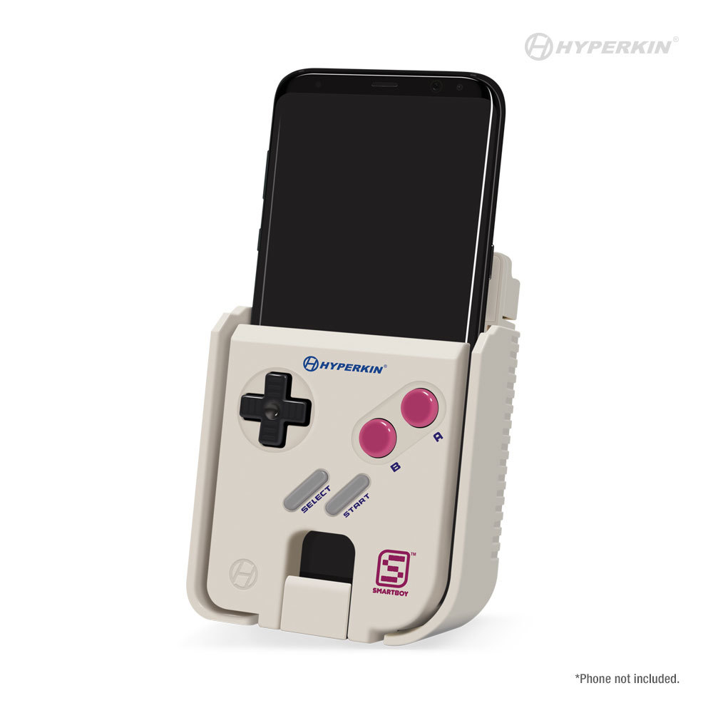

# Smartboy Dumper



The [Smartboy](https://hyperkinlab.com/products/smartboy/) is an accessory
for USB-C equipped smartphones. The smartphone slides in the opening and
connects with the USB-C plug when it reaches the bottom. You then have
a contraption that looks like a very expensive Game Boy/Game Boy Color console.

## Hardware

Alternatively, using a cheap USB-C/USB-A adapter, one can plug the device
into a normal PC. Although this is pretty cumbersome for normal usage, as
the USB-C plug is pretty loose, it's good enough for development, as was
done here.

The Smartboy will show up as 2 separate devices:
- one `NES PC Game Pad` input device for the D-pad, 4 face buttons, and 2
  shoulder buttons
- one USB ACM serial port

The input device is pretty uninteresting, as all the buttons work, and are
usable by the host OS.

The USB ACM serial port is used on Android by the official [Smartboy Companion](https://play.google.com/store/apps/details?id=hyperkin.smartboyserial&hl=en)
application to temporarily dump the contents of the Game Boy (Color) cartridge
that's plugged into it. The builtin software will also remove the dumped ROM from
the phone as soon as the cartridge doesn't make a good connection.

## Software

Using Android X86 in a virtual machine, and a copy of the official application,
I captured the communications between the device and the application. In parallel,
I also disassembled the app's APK using [APKTool](https://ibotpeaches.github.io/Apktool/).

[One file](disasm/h.smali) in the disassembly contained interesting strings that were present in the
USB captures (with some spoilers in the margin):
```
    const-string v1, "start"            # START
    const-string v1, "end"              # END
    const-string v1, "nr"               # No ROM
    const-string v1, "rom"              # ROM
    const-string v1, "srm"              # SRAM
    const-string v1, "ms"
    const-string v1, "vs"
    const-string v1, "nm"               # NAME
    const-string v1, "rb"               # ROM Banks (x16k = size)
    const-string v1, "sd"               # Start Dump
```

`nm` and `rb` appear constantly when connecting to the serial port with a terminal
emulator, the former being the detected name of the ROM on the cartridge, `rb` being
the detected ROM size ("ROM banks").

`sd` also appears in our dumps, and is sent by the host to start the dumping process.

The protocol looks like `nmROMNAMErb256` repeated until a command is sent. Sending `sd`,
will make `start` followed by `rom` appear, followed by the contents of the ROM. The ROM
data end with `end`, sometimes followed by `vs`. If the cartridge contains a support SRAM,
`srm` will appear after the end of the ROM data, followed by the SRAM content, before `end`
is finally shown.

`nr` will appear continuously if no game pak is inserted.

`FIXME`: `ms` looks like it means "Mass Storage" and `vs` is "Serial Com" but they never
appeared in a USB dump on my retail unit. Maybe a feature of the developer version?

## Smartboy Dumper

The Smartboy Dumper was written to document and have a proof of concept for applications
on phone OSes could use the Smartboy's cartridge dumping feature without using Hyperkin's,
fiddly, Android-only, application.

Note that the disassembled source and reverse-engineering were done on the assumption that:
```
it is hard to imagine how something that is available for free can be stolen
```
[as Hyperkin say themselves on their website](http://retron5.in/node/3).

## License

GNU GPL v3+
